# Git使用教程

## 简要介绍

Git是一个开源的分布式版本控制系统，用于高效的处理任何大小的项目。

以下是一些基本命令

```python
cd name 切换到目录下
cd  .. 回退到上一级目录
mkdir name 在当前目录下创建目录
touch name 会创建文件（如果文件已存在不会有影响），可以指定后缀
echo “XXX”>test.txt 将会把内容写入文件
echo “XXX”>>test.txt 会创建文件并写入
cat filename 可以显示文件内容
```


在强制命令行中退出使用:ESC+:+wq在回车即可


## Git的工作流程

+ 克隆Git资源作为工作目录

+ 在克隆的资源上添加或者修改文件

+ 如果其他人修改了资源，可以选择更新资源

+ 在提交前查看修改

+ 提交修改

+ 修改完成后，如果发现错误可以撤回并再次修改

  

  

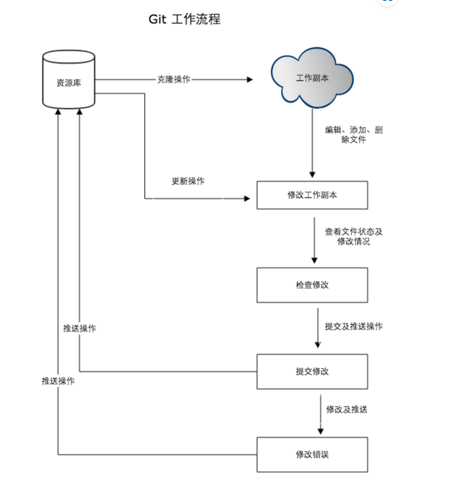

## Git中的区域

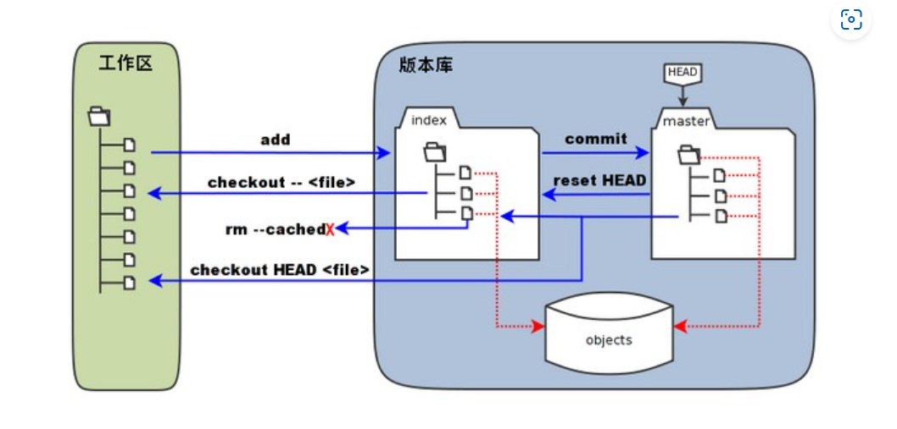


+ 图中左侧为工作区，右侧为版本库，其中标记有index的是暂存区，标记有master是master分支所代表的目录树，HEAD相当于一个指向master的指针。
+ object标识的区域为Git的对象库，，里面包含了各种创建的对象。
+ 当对工作区修改或新增文件的时候，暂存区的目录树会被更新，同时变化的文件内容会被存储到对象库中一个新的对象中，该对象的ID会被记录到暂存区的索引中。
+ 当执行提价操作时，暂存区的目录树会被写到对象库中，同时master所指的分支会更新为暂存区的目录树。
+ 当执行git reset HEAD操作时暂存区的目录树会被重写，背master所指的目录树替换，工作区不受影响。
+ 当执行git rm -cached<file>指令时，会从暂存区删除文件，而工作区不变。
+ 当执行git checkout,git checkout -<file>时，会用暂存区的全部会指定的文件替换工作区的文件。
+ 当执行git checkout HEAD,git checkout HEAD<file>时,会用master分支中全部或指定的文件替换工作区以及暂存区的所有文件。

Git的工作就是创建和保存项目的快照以及与之后的快照进行对比。

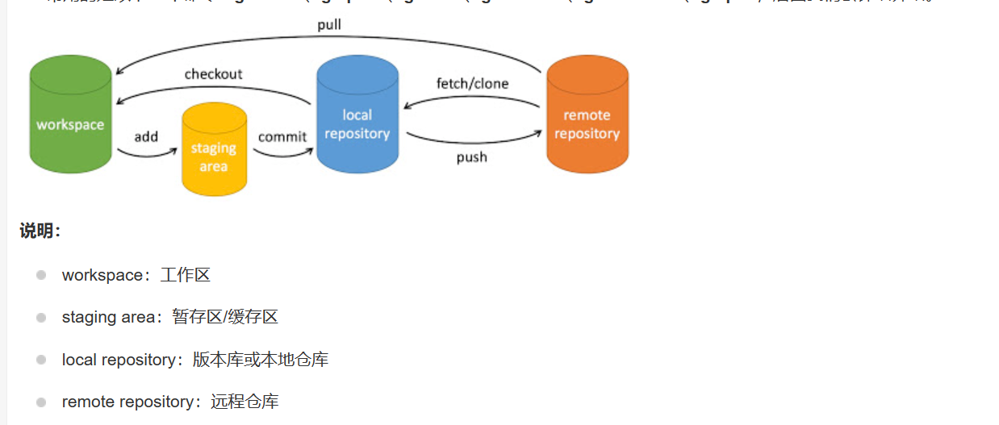


## Git基本操作

> | `git init`  | 初始化仓库                             |
> | ----------- | -------------------------------------- |
> | `git clone` | 拷贝一份远程仓库，也就是下载一个项目。 |
>
> 提交与修改
>
> | `git add`                           | 添加文件到暂存区，git add .会添加所有的修改 |
> | ----------------------------------- | ------------------------------------------- |
> | `git status`                        | 查看仓库当前的状态，显示有变更的文件。      |
> | `git diff`                          | 比较文件的不同，即暂存区和工作区的差异。    |
> | `git commit`                        | 提交暂存区到本地仓库。                      |
> | `git reset`                         | 回退版本。                                  |
> | `git rm`                            | 将文件从暂存区和工作区中删除。              |
> | `git mv`                            | 移动或重命名工作区文件。                    |
> | `git checkout`                      | 分支切换。                                  |
> | `git switch （Git 2.23 版本引入）`  | 更清晰地切换分支。                          |
> | `git restore （Git 2.23 版本引入）` | 恢复或撤销文件的更改。                      |
>
> 提交日志
>
> | `git log`          | 查看历史提交记录                     |
> | ------------------ | ------------------------------------ |
> | `git blame <file>` | 以列表形式查看指定文件的历史修改记录 |
>
> 远程操作
>
> | `git remote` | 查看当前的远程仓库 |
> | ------------ | ------------------ |
> | `git fetch`  | 从远程获取代码库   |
> | `git pull`   | 下载远程代码并合并 |
> | `git push`   | 上传远程代码并合并 |


git 是多人协作使用的，如果别人提交了修改，你在本地再次推送时会被拒绝，因为会覆盖修改，一般的开发中都是先git pull在push的，但对于个人记录笔记来说可以直接**git push --f强制推送**(不知道为什么推送被拒了)


## 创建仓库

通过命令git init 会初始化当前目录为一个git仓库，git init newrepo会将newrepo会初始化指定的目录为git仓库。


在初始化后目录中会出现名为.git的目录，所有Git所需的数据和资源都会存放在这个目录下。

如果当前目录下有几个文件想要纳入版本控制，需要先用git add命令让Git对这些文件进行跟踪，然后再提交。

```C
git add *.c 
git add README
git commit -m "初始化项目版本"
```


> 将当前目录下以c结尾的和名为readme的文件提交到仓库中,注意引号要是双引号


克隆项目

```python
git clone  repo
git clone repo  directory
```

> 克隆现有的项目，克隆到指定的位置


设置配置

```python
git config -list
git config -e    
git config -e --global   
git config --global user.name "runoob"
git config --global user.email test@runoob.com
```

> 显示当前配置
>
> 规定后面的修改是对于当前仓库的
>
> 规定后面的操作是对于所有仓库的
>
> 对全体仓库修改用户名
>
> 对全体仓库修改邮箱

下图展示了配置中有哪些参数

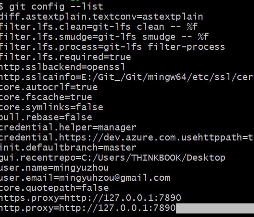


## 分支管理

使用分支表示可以从开发主线分离开，然后在不影响主线的情况下继续工作。

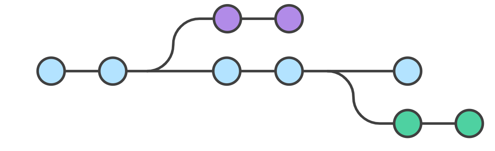

对一个目录操作的过程中，不断切换分支，目录下对应的文件也是在不断变化的：a分支下的test.txt文件和b分支下的test.txt文件是不同的，改变其中一个不会影响到另一个。


```python
git branch 列出分支，默认下会有master分支，列出的分支中前方带有星号表示当前的所处的分支

git branch name 创建分支 ，在当前位置常见的分支会包含有原位置的资源副本

git branch -M name 重命名当前分支

git checkout name 切换分支，当切换分支时，Git会使用该分支最后提交的快照替换当前的工作目录中的内容，所以多个分支不需要多个目录

git checkout -b name  创建并立即切换到新分支

git branch -d name 删除分支

git merge name 将指定分支合并到当前分支，这里合并的是修改，如果a中有a.c b中有a.c，b把其中的a.c删除后，合并到a中，最后a里面是不会有a.c的因为在b里面把他删除了
```


在使用merge是会出现冲突，比如说两个人对同一个文件的同一个位置修改了，合并时就会出现冲突。

对于冲突的位置Git会选择让用户自己决定取舍：


在文件中会被如图所示的方式排版，注意多余的标识符要删干净

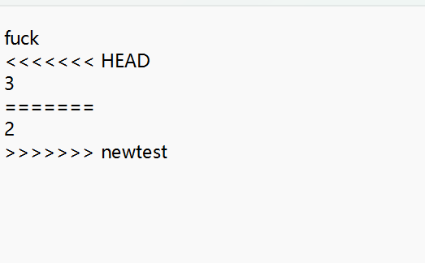


在解决冲突之后要追踪修改

## 查看提交历史

git log [选项] [分支名/提交哈希]


选项如下，注意选项可以结合使用：

> - `--oneline`：以简洁的一行格式显示提交信息
> - `--graph`：以图形化方式显示分支和合并历史
> - `--author=<作者>`：只显示特定作者的提交 git log --author=Linus --oneline -5 名字不需要加引号。-5表示输出最符合的5条
> - `--since=<时间>`：只显示指定时间之后的提交  git log --oneline --before={3.weeks.ago} --after={2010-04-18} 
> - `--until=<时间>`：只显示指定时间之前的提交


git blame [选项] <文件路径>

选项如下：

> - `-L <起始行号>,<结束行号>`：只显示指定行号范围内的代码注释。
> - `-C`：对于重命名或拷贝的代码行，也进行代码行溯源。
> - `-M`：对于移动的代码行，也进行代码行溯源。
> - `-C -C` 或 `-M -M`：对于较多改动的代码行，进行更进一步的溯源。


## Git远程仓库

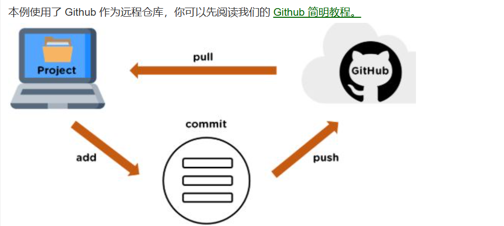

如果想通过git分享代码或者合作，那么就需要将数据放到一台其他人员能连接到的服务器上。


用于添加一个远程仓库到本地并命名为origin，其中XXX是在github上创建的远程仓库的SSH协议用于关联

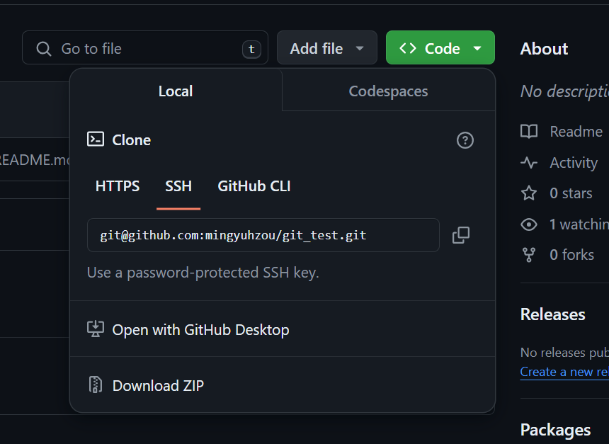

```python
git remote add origin XXX
```


将本地的 `main` 分支推送到远程仓库的 `main` 分支，并设置跟踪关系。

```python
git push -u origin main
```

这里的-u表示设置关联关系，，这样之后在分支中push和pull时可以直接简写git push/pull 远程仓库名 [分支名]，分支名可以省略


从远程仓库的 `main` 分支拉取代码并合并到本地的 `main` 分支

```python
git pull origin main
```


在本地仓库做了修改，使用git push origin推到远程仓库上，在远程仓库上做了修改git push origin获取修改并合并 


`git remote rm 仓库名` 用于删除远程仓库。


在日常的更新中，首先把所有的修改提交，然后再更新远程仓库。

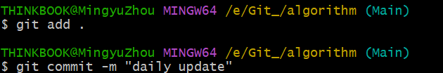

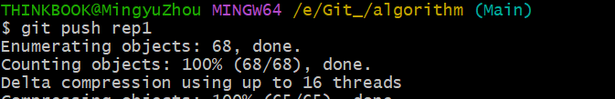


## 标签

有点类似于给软件打个v1.0版本一样

`git tag` 查找所有的标签

`git tag <tagname> `打上标签     `git tag -a<tagname> commit_id`给**指定**的版本打上标签

`git tag -a <tagname>` 记录这标签是什么时候打的，谁打的，添加个标签的注解


 `git push origin <tagname>`默认的Push不会将标签推到仓库，需要**手动添加**
	`git push origin --tags`   推送**所有标签**


`git checkout <tagname>` 切换到某个标签指向的版本，此时会进入“分离头指针”状态，这意味着没有在一个具体的分支上，因为 tag 相当于是一个**快照**，是不能**更改**它的代码的

如果要在 tag 代码的基础上做修改，你需要一个分支：

`git checkout -b branch_name tag_name`


`git tag -d <tagname>` **本地**删除标签

`git push origin --delete <tagname>`  删除远程仓库的标签


`git show tagname` 查看此版本所修改的内容


## 版本回退

`git reset --hard <commit_hash>`会将当前分支指针回退到 `<commit_hash>`，并且会**丢弃**所有工作区和暂存区的修改。这是最彻底的回退方式。


其中<commit_hash>通过**git log --oneline**查看(由于提交过多显示会被折叠，需要按住enter才能往下显示)，就是左侧的**哈希值**

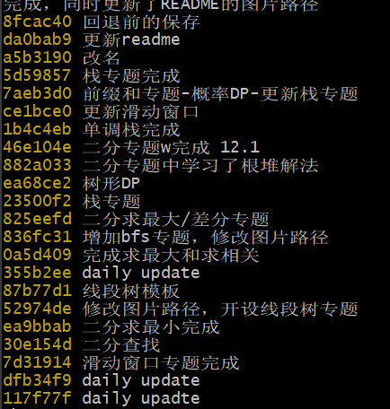

但是git log只能看到**当前状态之前的提交**，当切换到之前的版本后如果想再回来，需要使用**git reflog**命令查看所有的提交记录，然后选择对用的commit_id即可。


## Github限制

GitHub支持上传单个文件最大为**100MB**。对于大于100MB的文件，需要使用**Git LFS进行管理。**

GitHub**没有严格的仓库大小上限**，但建议仓库大小保持在1GB以下，以确保性能。


## LFS传送大文件

Github会阻止上传超过**100MB**的文件，想要上传大文件需要使用**GIT LFS**

LFS会在github存储一个指针，而将真正的数据放到LFS的服务器，免费的额度是1GB

1. 在官网下载Git LFShttps://git-lfs.com/
2. 在仓库初始化LFS——`git lfs install`，让仓库支持使用lfs
3. 跟踪文件类型 `git  lfs track "*.zip“`替换**双引号**中的内容，注意单个文件尽量**跟踪对应的文件名**而不是这种类型，否则原本的文件会被存为指针。
4. `git add .gitattributes` 或者也可以和之后的文件一起用通配符添加
5. 正常的添加提交推送即可

注意如果是**在推送失败后使用LFS依然会失败**，需要**回退到推送之前的的提交**，再添加提交推送一次。


使用了LFS后clone文件需要使用`git lfs clone`加快速度，一般的clone会因为网速过慢而中断，也可以

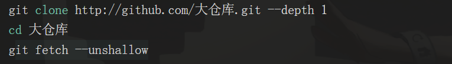


拉取修改也要使用`git lfs pull` 


## Github下载历史版本

首先clone项目到本地

复制对应提交的**SAH**


进入到仓库**git checkout SHA**就到了对应的提交版本


或者也可以直接点击右侧的**<>**便可跳转下载
